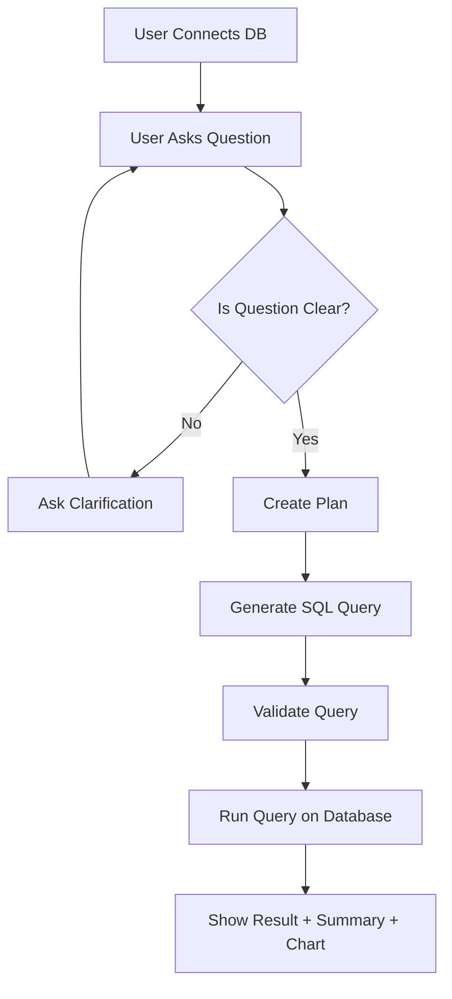
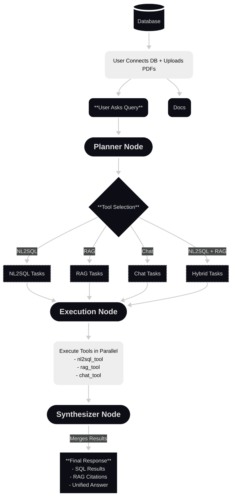

# DataMind — AI-Powered Data Intelligence

A production-grade enterprise data platform that lets you query databases and documents in plain English — no SQL, no manual searching, just instant, grounded answers.

---

## What It Does

DataMind provides two AI-powered pipelines:

1. **NL2SQL Pipeline** converts plain-English questions into validated SQL queries (SELECT, INSERT, UPDATE, DELETE), executes them against your PostgreSQL database, and returns results as tables, auto-suggested charts, and plain-English summaries.
2. **DataCopilot** answers questions from your uploaded PDF documents with cited, confidence-scored answers. For complex queries, it automatically combines live database figures with document context into a single synthesized answer.

---

## Architecture

### NL2SQL Pipeline

```
User Question
    ↓
Clarifier        → Is the query specific enough? Ask follow-up if not
    ↓
Planner          → Structured intent: metrics, dimensions, filters, candidate tables
    ↓
SQL Generator    → PostgreSQL query (supports SELECT / INSERT / UPDATE / DELETE)
    ↓
Validator        → Block forbidden keywords; enforce WHERE on mutations
    ↓
Executor         → Run query; auto-retry with error feedback on failure
    ↓
Summary + Chart  → Plain-English summary + auto-suggested chart type
```

## Flowchart


### DataCopilot (Agent Graph)

```
User Question
    ↓
Planner Node      → Decide tools: nl2sql | rag | chat
    ↓
Execution Node    → Run nl2sql_tool and/or rag_tool in parallel
    ↓
Synthesis Node    → Merge SQL results + RAG citations into one answer
```

## Flowchart

---

## Quick Start

### 1. Clone & install backend

```bash
git clone <repo-url>
cd NL2SQL-Chatbot-Agent/backend
python -m venv .venv && source .venv/bin/activate
pip install -r requirements.txt
```

### 2. Configure environment

```bash
cp env.example .env
# Edit .env with your keys
```

| Variable | Required | Description |
|---|---|---|
| `LLM_PROVIDER` | ✅ | `huggingface`, `openai`, or `groq` |
| `HUGGINGFACEHUB_API_TOKEN` | If HuggingFace | HF Inference API token |
| `OPENAI_API_KEY` | If OpenAI | OpenAI API key |
| `GROQ_API_KEY` | If Groq | Groq API key |
| `DATABASE_URL` | Optional | SQLite (default) or PostgreSQL for session storage |

### 3. Start the backend

```bash
uvicorn main:app --reload --port 8000
```

### 4. Install & start the frontend

```bash
cd ../frontend
npm install
npm run dev
# Open http://localhost:8080
```

### 5. Docker (full stack)

```bash
docker-compose up --build
# Frontend: http://localhost:80
# Backend:  http://localhost:8000
```

---

## Project Structure

```
NL2SQL-Chatbot-Agent/
├── backend/
│   ├── api/
│   │   ├── chat.py              # NL2SQL + Copilot endpoints, session management
│   │   ├── docs.py              # PDF upload, list, delete
│   │   └── metrics.py           # Observability middleware + /metrics endpoint
│   ├── core/
│   │   ├── state.py             # AgentState TypedDict for LangGraph
│   │   ├── planner_schema.py    # PlannerOutput (tools, sql_tasks, rag_tasks)
│   │   ├── nl2sql_plan_schema.py # NL2SQLPlan (intent, metrics, tables, columns)
│   │   └── clarifier_schema.py  # ClarifierOutput (is_clear, question)
│   ├── db/
│   │   ├── schema.py            # Schema introspection (columns, PKs, FKs, samples)
│   │   ├── executor.py          # SQL execution with SELECT/mutation handling
│   │   └── connection.py        # psycopg2 connection + test
│   ├── graph/
│   │   ├── graph.py             # LangGraph pipeline definition
│   │   ├── planner_node.py      # Tool routing with follow-up awareness
│   │   ├── execution_node.py    # nl2sql_tool + rag_tool execution
│   │   └── synthesis_node.py    # Final answer assembly with citations
│   ├── llm/
│   │   ├── client.py            # Unified LLM client (HuggingFace / OpenAI / Groq)
│   │   └── *.py                 # Prompts and Pydantic output parsers
│   ├── memory/
│   │   ├── session_store.py     # NL2SQL session persistence (SQLAlchemy)
│   │   ├── chat_store.py        # Copilot chat persistence (SQLAlchemy)
│   │   ├── models.py            # ORM models: sessions, messages, request logs
│   │   └── db.py                # SQLite / Postgres engine setup
│   ├── nl2sql/
│   │   ├── clarrifier.py        # Ambiguity detection with context awareness
│   │   ├── planner.py           # Intent decomposition → NL2SQLPlan
│   │   ├── generator.py         # SQL generation + retry with error feedback
│   │   └── validator.py         # Safety validation (forbidden keywords, WHERE enforcement)
│   ├── rag/
│   │   ├── ingest.py            # Hybrid chunking (structure-aware + sentence fallback)
│   │   ├── search.py            # ChromaDB similarity search
│   │   ├── rag_services.py      # Query rewriting for follow-ups + answer generation
│   │   └── embeddings.py        # HuggingFace / OpenAI embedding selector
│   ├── tools/
│   │   ├── nl2sql_tool.py       # Read-only SQL tool for the Copilot agent
│   │   ├── rag_tool.py          # Vector search tool for the Copilot agent
│   │   └── chat_tool.py         # General conversation fallback
│   ├── main.py                  # FastAPI app, CORS, middleware, lifespan
│   └── requirements.txt
│
└── frontend/
    ├── src/
    │   ├── pages/
    │   │   ├── Home.tsx         # Landing page with use-case showcase
    │   │   ├── NL2SQL.tsx       # SQL chat interface with resizable results panel
    │   │   └── Copilot.tsx      # Document Q&A chat interface
    │   ├── components/
    │   │   ├── common/          # Sidebar, ChatMessage, ChatInput, ThinkingIndicator
    │   │   ├── nl2sql/          # DBConnectionModal, ResultsPanel, ChartDisplay, TableDisplay
    │   │   └── copilot/         # DocUploadModal
    │   ├── api/client.ts        # All API calls (typed fetch wrappers)
    │   ├── context/AppContext.tsx # Global DB connection + docs state
    │   └── types/index.ts       # Shared TypeScript interfaces
    ├── tailwind.config.ts
    └── vite.config.ts           # Dev proxy to /api at localhost:8000
```

---


## Key Features

### NL2SQL

| Feature | Detail |
|---|---|
| Clarifier layer | Detects ambiguous queries and asks a follow-up before generating SQL. Follow-ups with context are marked clear automatically. |
| Auto-retry | On validation or execution failure, the exact error is fed back to the LLM for a corrected query — invisible to the user. |
| Safety validation | Blocks `DROP`, `ALTER`, `TRUNCATE`, `GRANT`, `REVOKE`. `UPDATE`/`DELETE` without `WHERE` are rejected. Unknown tables are blocked. |
| Follow-up awareness | Planner and clarifier both receive full conversation history and the previous SQL, so "filter by Germany" resolves correctly. |
| Chart auto-suggestion | Detects column types: text + numeric (≤6 rows) → pie, text + numeric (>6 rows) → bar, two numerics → line, scalar → table. |
| Session persistence | Every conversation is saved to SQLite/Postgres. Sessions can be renamed, restored, and deleted from the sidebar. |

### DataCopilot

| Feature | Detail |
|---|---|
| Hybrid chunking | Structure-aware splitting (headers, paragraphs, clauses) with sentence-level fallback — keeps legal clauses intact for accurate retrieval. |
| Query rewriting | Before hitting ChromaDB, vague follow-ups like "tell me more" are rewritten into concrete search queries using conversation history. |
| Confidence scoring | Every citation includes a 0–1 confidence score with a colour-coded bar (green ≥80%, amber 50–79%, red <50%). |
| Cross-pipeline synthesis | The LangGraph planner automatically routes to both SQL and RAG when needed and synthesizes a single coherent answer. |
| Grounding check | Synthesis is grounded in retrieved evidence only. If no citation confidence reaches 0.5, a "may not be fully grounded" warning is shown. |

---

## Extending the System

| Goal | Where to change |
|---|---|
| Add a new LLM provider | `llm/client.py` — add an `elif _PROVIDER == "..."` block |
| Change retrieval chunk count | `tools/rag_tool.py` — update `k=5` |
| Enable reasoning layer | Uncomment blocks in `graph/graph.py`, `graph/synthesis_node.py`, `llm/synthesis_prompt.py` |
| Add a new API tool to the Copilot agent | `tools/` — create a new tool function; register in `graph/execution_node.py` |
| Change chart thresholds | `api/chat.py` — `_suggest_chart()` |
| Add embedding model | `rag/embeddings.py` — add new provider block |

---

## Requirements

- Python ≥ 3.10
- Node.js ≥ 18
- A hosted PostgreSQL database (Supabase, Neon, Railway, Render — local databases are not reachable from a deployed backend)
- API key for at least one LLM provider (HuggingFace free tier available)